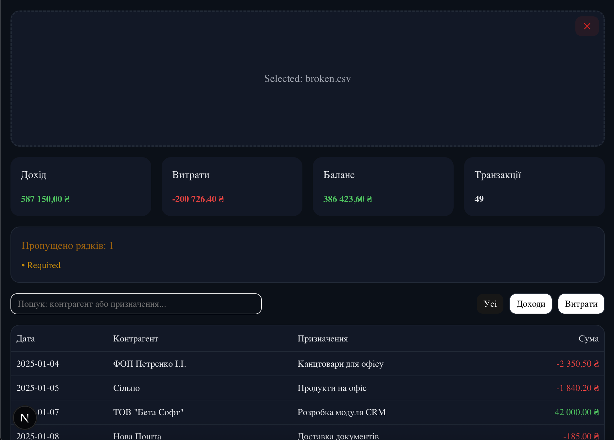

## Як запустити

```bash
npm install && npm run dev
# застосунок буде доступний на http://localhost:3000
```

## Коротко про рішення (що було неочевидно)
- Уніфіковано підрахунки через `calculateStatement`, щоб уникнути дублювання логіки в UI.
- Виправлено TS-типи в компонентах (`SummaryCards`, `TopExpenses`, таблиця банку) та вирівняно пропси з фактичними даними.
- Усунуто помилку гідрації (SSR/CSR) через різні символи валюти: замість `toLocaleString(..., { style: 'currency' })` додано детермінований форматер `formatUAH`, який гарантує однаковий рендер на сервері й клієнті.
- Додано валідацію CSV-рядків через `zod` та відображення пропущених рядків із причинами (компонент `SkippedRows`).

## Скриншот головної сторінки


